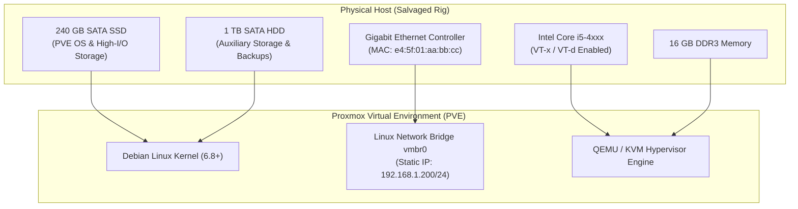
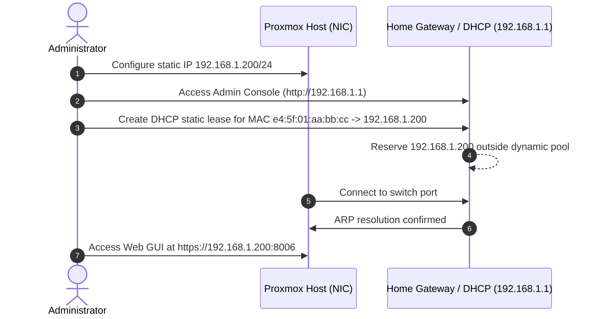
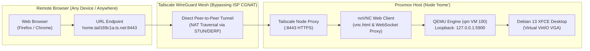

## 1. Hardware Acquisition and Board-Level Repair ($150 Budget)

Building an enterprise-capable virtualization environment does not require modern enterprise rackmount servers. With a total budget under $150, I sourced a pre-owned desktop tower designed around an Intel Core i5 4th-generation platform.

### Specifications
* **CPU:** Intel Core i5-4570 (4 Cores, 4 Threads, 3.20 GHz base / 3.60 GHz turbo, VT-x and VT-d support)
* **Memory:** 16 GB DDR3 1600 MHz (Dual-Channel 2x8GB)
* **Primary Storage:** 240 GB 2.5" SATA III SSD (Dedicated to Proxmox VE OS, base templates, and high-I/O root disks)
* **Secondary Storage:** 1 TB 3.5" 7200 RPM SATA HDD (Dedicated to VM virtual disks, container root volumes, and local backup archives)
* **Network:** Integrated Intel Gigabit Ethernet Controller (`e1000e`)

### The Hardware Short Circuit
When initially connected to bench power, the machine exhibited zero activity: the standby LED failed to illuminate and the power supply entered over-current protection shutdown immediately upon switching on. 

Using a multimeter in continuity mode, I traced the 12V and 5V power delivery rails on the motherboard. The circuit showed an immediate short to ground. Over two days of methodical troubleshooting—isolating peripheral headers, inspecting motherboard filtering capacitors, and cleaning corroded circuit traces near the primary VRM circuitry—I identified and resolved the faulty current path. Once normal resistance was restored across the rails, the system completed POST, passed memtest86 with zero errors, and remained thermally stable under continuous load.

<figure>
  
  <figcaption>Figure 1: The operational $150 homelab rig following board-level repair and cable dressing.</figcaption>
</figure>



---

## 2. Proxmox VE Installation & Network Subnet Integration

### Installation Media & BIOS Preparation
1. Download the official Proxmox VE ISO image.
2. Flash the ISO onto a USB flash drive using BalenaEtcher, Rufus in DD mode, or Ventoy.
3. Boot the desktop into BIOS setup:
   * Enable **Intel Virtualization Technology (VT-x)**.
   * Enable **Intel VT-d** for I/O memory virtualization.
   * Configure SATA controller mode to **AHCI**.
   * Set boot order priority to the 240 GB SATA SSD.

### Target Disk Allocation
During the installation wizard, target the 240 GB SSD (`/dev/sda`). The default ext4 filesystem layout creates a dedicated root volume and an `lvm-thin` pool (`local-lvm`) optimized for fast, copy-on-write snapshotting of guest VM disks.

### Network Subnet Planning
To ensure deterministic connectivity, assign a static IP address on your primary local subnet rather than relying on ephemeral dynamic leases:

| Parameter | Configuration Value | Context |
| :--- | :--- | :--- |
| **Hostname** | `pve-node-01.local` | Fully qualified domain name |
| **IP Address** | `192.168.1.200/24` | Static node IP outside typical DHCP client pools |
| **Gateway** | `192.168.1.1` | Primary residential router / firewall IP |
| **DNS Server** | `192.168.1.1` (or `1.1.1.1`) | Local gateway DNS resolver |

### Router DHCP Reservation
A static IP configured solely on the host risks address collisions if the residential router assigns that same IP to another client before the server boots.

To eliminate this conflict:
1. Log into your home router administration console (`http://192.168.1.1`).
2. Navigate to **LAN Setup** > **DHCP Server** > **Address Reservation** (or **Static Leases**).
3. Bind the physical MAC address of the server's Ethernet card (e.g. `e4:5f:01:aa:bb:cc`) permanently to `192.168.1.200`.

This dual-layer approach guarantees that the router's DHCP daemon will never distribute `192.168.1.200` to other devices, while the server retains connectivity even if the router's DHCP daemon temporarily restarts.



---

## 3. Post-Installation Automation via Helper Scripts

Upon first booting into the Proxmox Web GUI (`https://192.168.1.200:8006`), the system is configured by default for enterprise customers with active commercial subscription keys.

Rather than manually modifying multiple APT source files and patching javascript libraries, we execute the vetted Proxmox VE Community Post-Install script directly from the host console:

```bash
bash -c "$(wget -qLO - https://github.com/community-scripts/ProxmoxVE/raw/main/ct/post-pve-install.sh)"
```

### Key Tasks Performed by the Script
1. **Disables Enterprise Repository:** Comments out the commercial `pve-enterprise` source in `/etc/apt/sources.list.d/pve-enterprise.list`, which otherwise produces HTTP 401 Unauthorized errors during updates.
2. **Enables No-Subscription Repository:** Adds the community repository (`deb http://download.proxmox.com/debian/pve bookworm pve-no-subscription`) to `/etc/apt/sources.list`, granting access to official upstream security and package updates.
3. **Disables Subscription Nag Dialog:** Patches the web interface scripts (`/usr/share/javascript/proxmox-widget-toolkit/proxmoxlib.js`) so the "No Valid Subscription" modal does not block login workflows.
4. **Updates CPU Microcode:** Automatically installs the `intel-microcode` package to mitigate known hardware-level CPU vulnerabilities and stabilize clock scaling.
5. **Enables Storage TRIM:** Sets up discard operations on SSD volumes to preserve flash longevity and prevent fragmentation.

---

## 4. Storage Expansion, Firewall Hardening, and Access Control

### Mounting the 1 TB HDD for Auxiliary Storage
The 1 TB mechanical drive serves as mass storage for ISO images, LXC container templates, and scheduled VM backup dumps (vzdump):

```bash
# Partition and format the secondary disk
fdisk /dev/sdb
mkfs.ext4 -m 1 /dev/sdb1

# Create persistent mount point in fstab
mkdir -p /mnt/hdd-data
echo "/dev/sdb1 /mnt/hdd-data ext4 defaults,noatime 0 2" >> /etc/fstab
mount -a
```

In the Proxmox Web UI, navigate to **Datacenter** > **Storage** > **Add** > **Directory**:
* **ID:** `hdd-storage`
* **Directory:** `/mnt/hdd-data`
* **Content:** ISO image, VZDump backup file, Container template, Disk image

### Firewall Configuration
Proxmox incorporates a 3-tier stateful firewall: Datacenter (cluster), Node, and Guest VM/LXC.

1. **Datacenter Level:** Enable the firewall with default Input Policy set to `DROP` and Output Policy set to `ACCEPT`.
2. **Node Level (`pve-node-01`):** Define explicit incoming rules for administrative access:
   * **TCP 8006:** Proxmox Web Console (restricted to source IP `192.168.1.0/24` and VPN subnet).
   * **TCP 22:** SSH administrative access (restricted to local subnet and VPN).
   * **ICMP:** Echo request (Ping) allowed for local network monitoring.

### Role-Based Access Control (RBAC)
Never perform day-to-day administration under the default `root@pam` account. Instead:
1. Navigate to **Datacenter** > **Permissions** > **Users** > **Add**.
2. Create an administrative user in the `pve` realm (e.g. `throne@pve`).
3. Under **Permissions**, assign the `Administrator` role to `throne@pve` scoped to `/`.
4. Configure Two-Factor Authentication (TOTP) under **Two-Factor Authentication** for all administrative accounts.

---

## 5. System Health & VM Telemetry

With basic services active, real-time telemetry is essential to verify thermal thresholds, CPU allocation, and memory distribution across virtual instances.

<figure>
  
  <figcaption>Figure 2: Real-time telemetry on node 'home' displaying VM 100 (NVM) resource consumption and host headroom.</figcaption>
</figure>

In our live dashboard for **Virtual Machine 100 (NVM)** running on node `home`:
* **Workload:** Debian 13 (amd64) with lightweight XFCE desktop and container tooling.
* **CPU Allocation:** 2 vCPUs running at idle baseline (< 0.5% compute draw).
* **Memory Footprint:** 4.09 GiB allocated, with active guest consumption sitting at **14.36% (602.10 MiB)** and host memory allocation at 867 MiB.
* **Storage:** 32 GiB thin-provisioned root disk on the SATA SSD.

The 16 GB physical DDR3 capacity leaves over 11 GB of unallocated headroom for additional microservices, isolated testing sandboxes, and virtualized routing experiments.

---

## 6. Zero-Trust Remote Access: Bypassing CGNAT and Hosting `vnc.html`

### The Real-World Obstacle: Carrier-Grade NAT (CGNAT)
In many residential networking environments (including standard ISP connections in Tunisia), traditional port forwarding is **technically impossible**. 

Internet Service Providers deploy **Carrier-Grade NAT (CGNAT)** under the RFC 6598 address block (`100.64.0.0/10`). The residential router's WAN interface receives a shared carrier private address rather than a routable public IPv4 address. Because inbound packets from the public internet cannot be mapped through the upstream carrier gateways, standard WAN port forwarding fails completely.

To establish reliable ingress without a public IP or third-party port forwarding hacks, we deploy **Tailscale** directly on the Proxmox host (`node home`):

```bash
# Install Tailscale on the Proxmox host
curl -fsSL https://pkgs.tailscale.com/stable/debian/bookworm.noarmor.gpg | sudo tee /usr/share/keyrings/tailscale-archive-keyring.gpg >/dev/null
curl -fsSL https://pkgs.tailscale.com/stable/debian/bookworm.tailscale-keyring.list | sudo tee /etc/apt/sources.list.d/tailscale.list

sudo apt-get update && sudo apt-get install -y tailscale

# Authenticate and establish the mesh node
sudo tailscale up --advertise-routes=192.168.1.0/24 --accept-dns=false
```

Tailscale uses STUN and DERP relay coordination to establish direct outbound WireGuard peer-to-peer tunnels, seamlessly piercing both the local router and the ISP's CGNAT barriers.

### QEMU Framebuffer & Virtual VGA under `qm`
Rather than enabling an SSH server or managing SSH tunnels, we leverage how Proxmox's QEMU manager (`qm`) handles graphical output natively:

1. **Virtual Display Driver:** When VM 100 is configured with a display adapter (`vga: virtio` or `vga: std`), the guest kernel (Debian XFCE) renders its visual workspace directly into virtual video memory.
2. **Loopback VNC Socket:** QEMU spawns an internal VNC server bound exclusively to loopback (`127.0.0.1`) on an assigned port corresponding to the VM ID (e.g. `127.0.0.1:5900` for display `:0` / VM 100). This keeps the VNC port completely isolated from the local physical network.
3. **The `vnc.html` Client:** Proxmox bundles the open-source noVNC web client, including the static HTML5 application `vnc.html`. This client bridges the VNC protocol over WebSockets, enabling graphical rendering directly in any modern web browser.

### Serving `vnc.html` Directly Through the Tailscale Mesh
By taking the loopback VNC service of VM 100 and hosting the static `vnc.html` interface through Tailscale (leveraging Tailscale's secure node proxying on port `8443` under the MagicDNS node domain `home.tail169c1a.ts.net`), we make the virtual desktop accessible over an encrypted HTTPS connection.

The browser connects directly to the static viewer with automatic authentication and display scaling:

```text
https://home.tail169c1a.ts.net:8443/vnc.html?autoconnect=true&resize=scale
```

* `autoconnect=true`: Immediately initiates the WebSocket handshake to the QEMU VNC loopback backend upon page load.
* `resize=scale`: Automatically resizes the virtual VGA framebuffer to match the client device's browser window.



<figure>
  
  <figcaption>Figure 3: Full Debian XFCE desktop session for VM 100 accessed in-browser via Tailscale mesh on port 8443 using vnc.html with automatic scaling.</figcaption>
</figure>

This architecture delivers a responsive, browser-native remote desktop experience:
* No port forwarding required on the home router.
* Complete immunity to ISP CGNAT limitations.
* No SSH tunnels, keys, or native VNC client software required on client devices.
* The entire display session is protected in transit with WireGuard encryption.

---

## Conclusion & Key Takeaways

With under $150 and two days invested in circuit-level repair, this setup proves that robust, enterprise-grade virtualization is attainable on modest consumer hardware:
* **Hardware Resilience:** Diagnosing and resolving power rail shorts salvages functional hardware from e-waste.
* **Network Stability:** Combining static host addressing with router-level DHCP reservations prevents IP collisions.
* **Streamlined Maintenance:** Proxmox Community Helper scripts automate repository and security microcode maintenance.
* **CGNAT Bypass & Remote GUI:** Leveraging Tailscale alongside QEMU's internal VNC architecture and `vnc.html` provides instantaneous remote desktop access without exposing a single port to the public internet.
